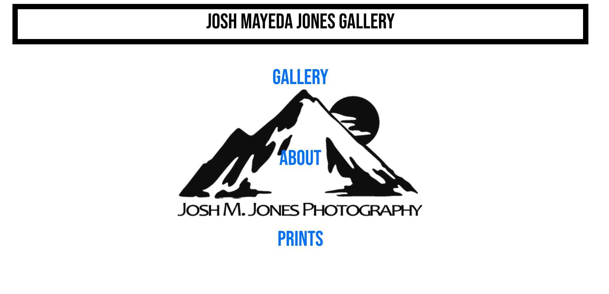
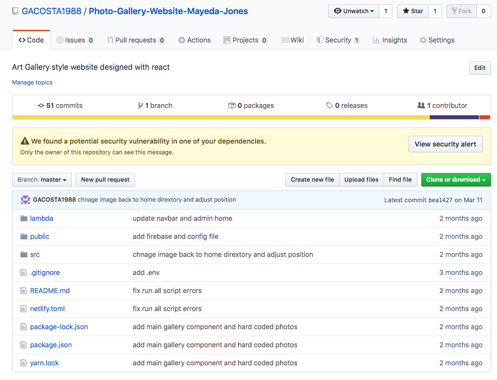

# Josh Mayeda Jones Photo Gallery

## By **George Acosta**

This repo is the e-commerce platform for Josh Mayeda Jones Photography

## Setup/Installation Requirements

### Zip:

1. Click [here](https://github.com/GACOSTA1988/Photo-Gallery-Website-Mayeda-Jones) to go to the repository location where you will find the clone/download menu.

2. Navigate to the directory (folder) that contains your browser's downloads.
3. Double-click on **Photo-Gallery-Website-Mayeda-Jones** directory (folder).
4. Open the directory contents by extracting/unzipping the documents from the folder.

##### Mac OS Installation

1. On OS X Run NPM I in the terminal
2. Once NPM Installation is complete, Run NPM Start.

##### Windows OS Installation

1. On Windows Run NPM I in the terminal
2. Once NPM Installation is complete, Run NPM Start.

## Specifications

---

## Technologies Used

- React 16.8.0
- Firebase 7.10.0
- FirebaseUI 4.4.0
- react-dropzone 10.2.1
- react-photo-gallery 8.0.0
- stripe 6.23.1
- netlify-lambda 1.3.3

---

## Troubleshooting

### Support and Contact

If you run into any issues running **Josh Mayeda Jones Photo Gallery**, please contact **George Acosta**.

### License

Permission is hereby granted, free of charge, to any person obtaining a copy of this software and associated documentation files (the "Software"), to deal in the Software without restriction, including without limitation the rights to use, copy, modify, merge, publish, distribute, sublicense, and/or sell copies of the Software, and to permit persons to whom the Software is furnished to do so, subject to the following conditions:

The above copyright notice and this permission notice shall be included in all copies or substantial portions of the Software.

THE SOFTWARE IS PROVIDED "AS IS", WITHOUT WARRANTY OF ANY KIND, EXPRESS OR IMPLIED, INCLUDING BUT NOT LIMITED TO THE WARRANTIES OF MERCHANTABILITY, FITNESS FOR A PARTICULAR PURPOSE AND NON-INFRINGEMENT. IN NO EVENT SHALL THE AUTHORS OR COPYRIGHT HOLDERS BE LIABLE FOR ANY CLAIM, DAMAGES OR OTHER LIABILITY, WHETHER IN AN ACTION OF CONTRACT, TORT OR OTHERWISE, ARISING FROM, OUT OF OR IN CONNECTION WITH THE SOFTWARE OR THE USE OR OTHER DEALINGS IN THE SOFTWARE.

Copyright (c) 2020 **George Acosta**
